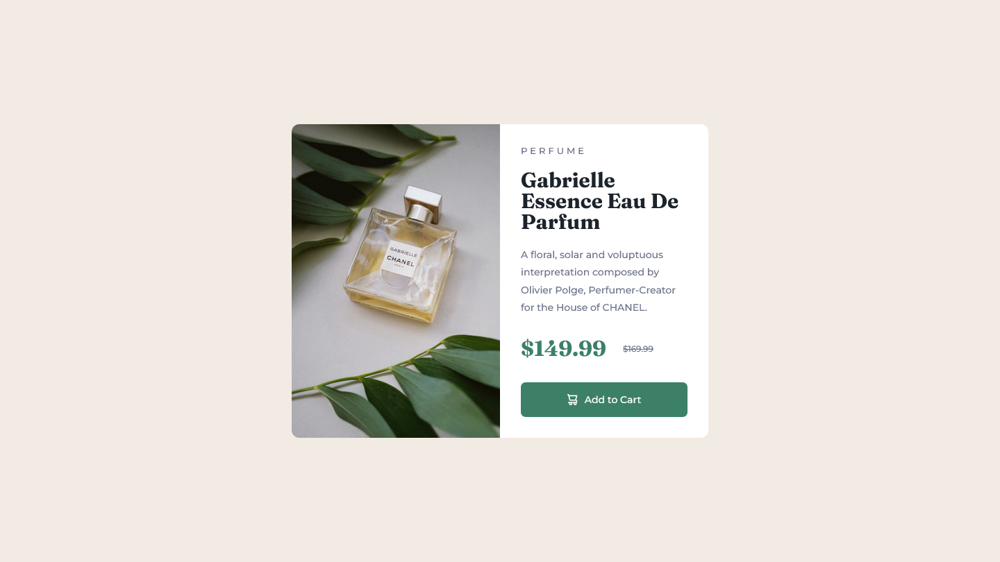

## Overview
### Challenge

This challenge involves creating a simple product preview card component. The page should display an optimal layout based on the size of the viewer's device. Interactive elements should have proper hover and focus states.

### Screenshot

### Links

- Solution:
- Live Site:

### Built with

- Semantic HTML5 markup
- CSS custom properties
- Flexbox
- CSS Grid
- Desktop-first workflow

### Continued development

Going forward, I want to get better with scaling down projects to smaller device sizes. For bigger projects, I aim to better plan ahead for how elements should change with the device size while avoiding cluttering the CSS with media queries. There are some awkward values in attempt to mimic Frontend Mentor's results that I feel could be improved.

## Author
- Frontend Mentor - [Isaiah-B][https://www.frontendmentor.io/profile/Isaiah-B]